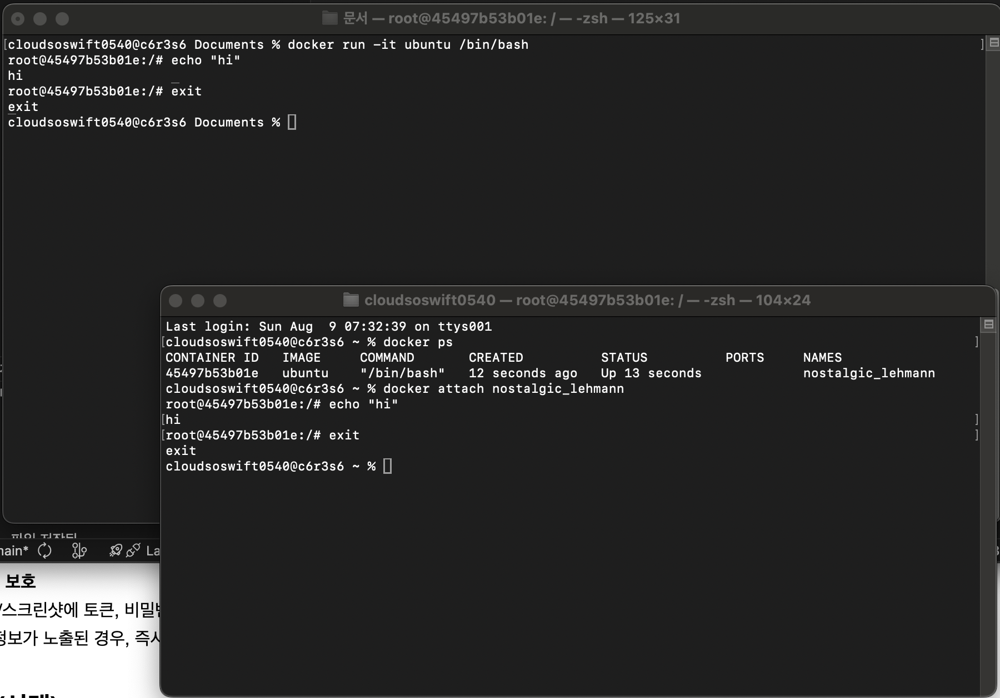

# workspace

## 프로젝트 개요

## 실행환경

## 수행항목 체크 리스트

## 1. 터미널 조작 로그 기록
```bat
// 현재 위치 확인
cloudsoswift0540@c4r1s1 workspace % pwd
/Users/cloudsoswift0540/Documents/workspace
// 파일 목록 확인(숨김 파일 포함)
cloudsoswift0540@c4r1s1 workspace % ls -a
.		..		.git		README.md
// 디렉토리 이동
cloudsoswift0540@c4r1s1 workspace % cd /Users/cloudsoswift0540/Documents 
// 빈 파일 생성. `touch A`는 A라는 이름의 빈 파일을 생성하겠다는 뜻
cloudsoswift0540@c4r1s1 Documents % touch emptyFile.txt
// 생성 되었는지 확인
cloudsoswift0540@c4r1s1 Documents % ls -a
.		..		.localized	emptyFile.txt	workspace
// 파일 복사. `cp A B`는 A 파일을 B라는 이름으로 복사하겠다는 뜻 
cloudsoswift0540@c4r1s1 Documents % cp emptyFile.txt emptyFile2.txt
// 복사되었는지 확인
cloudsoswift0540@c4r1s1 Documents % ls -a 
.		..		.localized	emptyFile.txt	emptyFile2.txt	workspace
// 이동/이름 변경. `mv A B`는 A라는 파일을 B로 이동하거나, B라는 이름으로 파일명 변경
// ex) `mv a.txt Documents/a.txt`: 현재 디렉토리의 a.txt 파일을 Documents 폴더로 이동
// ex) `mv a.txt b.txt`: 현재 디렉토리의 a.txt 파일의 이름을 b.txt로 변경
cloudsoswift0540@c4r1s1 Documents % mv emptyFile2.txt changedName.txt
// 이름 변경되었는지 확인
cloudsoswift0540@c4r1s1 Documents % ls
changedName.txt	emptyFile.txt	workspace
// 파일 삭제. `rm A` 는 A라는 파일을 삭제
cloudsoswift0540@c4r1s1 Documents % rm changedName.txt 
// 삭제되었는지 확인
cloudsoswift0540@c4r1s1 Documents % ls
emptyFile.txt	workspace
// 파일 내용 확인. `cat A`는 A 파일의 내용을 출력
cloudsoswift0540@c4r1s1 Documents % cat emptyFile.txt 
cloudsoswift0540@c4r1s1 Documents % cd ..
cloudsoswift0540@c4r1s1 ~ % cd Documents/workspace 
cloudsoswift0540@c4r1s1 workspace % cat README.md 
# workspace
cloudsoswift0540@c4r1s1 workspace % cd ..
// 파일 생성. `echo 'A' > B`는 A라는 내용을 포함하는 B라는 파일 생성
cloudsoswift0540@c4r1s1 Documents % echo 'Hello World!' > hello_world.txt
cloudsoswift0540@c4r1s1 Documents % ls                                   
emptyFile.txt	hello_world.txt	workspace
cloudsoswift0540@c4r1s1 Documents % cat hello_world.txt 
Hello World!
cloudsoswift0540@c4r1s1 Documents % 
```

## 2. 권한 실습 및 증거 기록
```bat
// 초기 권한 상태 확인
cloudsoswift0540@c4r1s1 workspace % ls -l
total 8
-rw-r--r--  1 cloudsoswift0540  cloudsoswift0540  2393 Jul 27 19:19 README.md
drwxr-xr-x  2 cloudsoswift0540  cloudsoswift0540    64 Jul 27 20:07 empty_folder
// 1. 기호 모드 (Symbolic mode)
// 기호 모드는 `chmod [ugoa] [-+=] [permissions]` 와 같은 조합으로 권한을 변경하는 방식.
// [ugoa]는 파일 소유자(u), 파일 그룹에 속한 다른 사용자(g), 파일 그룹에 속하지 않은 다른 사용자(o),
// 모든 사용자(a) 를 지정.
// [-+=] 는 파일 권한 비트를 추가할지(+), 제거할지(-), 대체할지(=)를 지정.
// [permissions]는 rwxXst 집단에 속하는 0개 이상의 문자.
// r은 읽기, w는 쓰기, x는 실행(또는 디렉토리 검색)을 뜻함.
// `u+x`는 파일 소유자에게 실행 권한을 추가할 것임을 뜻함
cloudsoswift0540@c4r1s1 workspace % chmod u+x README.md 
// 변경되었는지 확인
cloudsoswift0540@c4r1s1 workspace % ls -l
total 8
-rwxr--r--  1 cloudsoswift0540  cloudsoswift0540  2393 Jul 27 19:19 README.md
drwxr-xr-x  2 cloudsoswift0540  cloudsoswift0540    64 Jul 27 20:07 empty_folder
// `g-r`는 '파일 그룹에 속한 다른 사용자'에게 읽기 권한을 제거할 것임을 뜻함.
cloudsoswift0540@c4r1s1 workspace % chmod g-r README.md 
// 변경되었는지 확인
cloudsoswift0540@c4r1s1 workspace % ls -l
total 8
-rwx---r--  1 cloudsoswift0540  cloudsoswift0540  2393 Jul 27 19:19 README.md
drwxr-xr-x  2 cloudsoswift0540  cloudsoswift0540    64 Jul 27 20:07 empty_folder
// `o=rw`는 '파일 그룹에 속하지 않는 다른 사용자'의 권한을 '읽기/실행 가능' 으로 대체할 것을 뜻함.
cloudsoswift0540@c4r1s1 workspace % chmod o=rw README.md
// 변경 되었는지 확인
cloudsoswift0540@c4r1s1 workspace % ls -l
total 8
-rwx---rw-  1 cloudsoswift0540  cloudsoswift0540  2393 Jul 27 19:19 README.md
drwxr-xr-x  2 cloudsoswift0540  cloudsoswift0540    64 Jul 27 20:07 empty_folder
// 2. 숫자 모드 (numeric mode)
// 숫자 모드는 `chmod [ugo] 파일명`으로 권한을 설정
// 정확히는, ugo 위치에 각각에 대한 권한 비트합(0~7 사이의 값)을 위치시킴
// 권한 비트합은 읽기(4), 쓰기(2), 실행(1)의 합을 뜻함.
// ex) 5 = 읽기+실행, 6 = 읽기 + 쓰기
// 즉, 만약 `chmod 733 file.txt` 와 같이 명령을 실행했다면,
// '파일 소유자'(u)에게는 읽기+쓰기+실행 권한을,
// '파일 그룹에 속한 다른 사용자'(g)에게는 쓰기+실행 권한을 지정
// '파일 그룹에 속하지 않은 다른 사용자'(o)에게는 쓰기+실행 권한을 지정
// 예시로, 아래 644는 u에게 읽기+쓰기 권한을, g와 o에게는 읽기 권한을 부여한 것임
cloudsoswift0540@c4r1s1 workspace % chmod 644 README.md
// 변경 되었는지 확인
cloudsoswift0540@c4r1s1 workspace % ls -l
total 8
-rw-r--r--  1 cloudsoswift0540  cloudsoswift0540  2393 Jul 27 19:19 README.md
drwxr-xr-x  2 cloudsoswift0540  cloudsoswift0540    64 Jul 27 20:07 empty_folder
// 다음으로, 디렉토리의 권한을 수정
// 아래 711은 u에게 읽기+쓰기+실행 권한을, g와 o에게는 실행 권한을 부여
cloudsoswift0540@c4r1s1 workspace % chmod 711 empty_folder 
// 반영 되었는지 확인
cloudsoswift0540@c4r1s1 workspace % ls -l
total 8
-rw-r--r--  1 cloudsoswift0540  cloudsoswift0540  2393 Jul 27 19:19 README.md
drwx--x--x  2 cloudsoswift0540  cloudsoswift0540    64 Jul 27 20:07 empty_folder
// g에게 읽기 권한 추가
cloudsoswift0540@c4r1s1 workspace % chmod g+r empty_folder 
// 반영 되었는지 확인
cloudsoswift0540@c4r1s1 workspace % ls -l
total 8
-rw-r--r--  1 cloudsoswift0540  cloudsoswift0540  2393 Jul 27 19:19 README.md
drwxr-x--x  2 cloudsoswift0540  cloudsoswift0540    64 Jul 27 20:07 empty_folder
// o에게 읽기+쓰기 권한 부여
cloudsoswift0540@c4r1s1 workspace % chmod o=rx empty_folder 
// 반영 되었는지 확인
cloudsoswift0540@c4r1s1 workspace % ls -l
total 8
-rw-r--r--  1 cloudsoswift0540  cloudsoswift0540  2393 Jul 27 19:19 README.md
drwxr-xr-x  2 cloudsoswift0540  cloudsoswift0540    64 Jul 27 20:07 empty_folder
```

## 3. Docker 설치 및 기본 점검
```bat
// 도커 버전
cloudsoswift0540@c4r1s1 workspace % docker --version
Docker version 29.4.0, build 9d7ad9f
// 도커 상태
cloudsoswift0540@c4r1s1 workspace % docker info     
Client:
 Version:    29.4.0
 Context:    orbstack
 Debug Mode: false
 Plugins:
  buildx: Docker Buildx (Docker Inc.)
    Version:  v0.33.0
    Path:     /Users/cloudsoswift0540/.docker/cli-plugins/docker-buildx
  compose: Docker Compose (Docker Inc.)
    Version:  v5.1.2
    Path:     /Users/cloudsoswift0540/.docker/cli-plugins/docker-compose

Server:
 Containers: 0
  Running: 0
  Paused: 0
  Stopped: 0
 Images: 0
 Server Version: 29.4.0
 Storage Driver: overlayfs
  driver-type: io.containerd.snapshotter.v1
 Logging Driver: json-file
 Cgroup Driver: cgroupfs
 Cgroup Version: 2
 Plugins:
  Volume: local
  Network: bridge host ipvlan macvlan null overlay
  Log: awslogs fluentd gcplogs gelf journald json-file local splunk syslog
 CDI spec directories:
  /etc/cdi
  /var/run/cdi
 Swarm: inactive
 Runtimes: io.containerd.runc.v2 runc
 Default Runtime: runc
 Init Binary: docker-init
 containerd version: 77c84241c7cbdd9b4eca2591793e3d4f4317c590
 runc version: c241c0bb5e60a8e8c1b2e53d4eca8d0068d8d57e
 init version: de40ad0
 Security Options:
  seccomp
   Profile: builtin
  cgroupns
 Kernel Version: 6.19.13-orbstack-gbd1dc07b8cf4
 Operating System: OrbStack
 OSType: linux
 Architecture: x86_64
 CPUs: 6
 Total Memory: 15.67GiB
 Name: orbstack
 ID: 5fa467f8-e72c-4295-aff9-6916d7d79f6f
 Docker Root Dir: /var/lib/docker
 Debug Mode: false
 Experimental: false
 Insecure Registries:
  ::1/128
  127.0.0.0/8
 Live Restore Enabled: false
 Product License: Community Engine
 Default Address Pools:
   Base: 192.168.97.0/24, Size: 24
   Base: 192.168.107.0/24, Size: 24
   Base: 192.168.117.0/24, Size: 24
   Base: 192.168.147.0/24, Size: 24
   Base: 192.168.148.0/24, Size: 24
   Base: 192.168.155.0/24, Size: 24
   Base: 192.168.156.0/24, Size: 24
   Base: 192.168.158.0/24, Size: 24
   Base: 192.168.163.0/24, Size: 24
   Base: 192.168.164.0/24, Size: 24
   Base: 192.168.165.0/24, Size: 24
   Base: 192.168.166.0/24, Size: 24
   Base: 192.168.167.0/24, Size: 24
   Base: 192.168.171.0/24, Size: 24
   Base: 192.168.172.0/24, Size: 24
   Base: 192.168.181.0/24, Size: 24
   Base: 192.168.183.0/24, Size: 24
   Base: 192.168.186.0/24, Size: 24
   Base: 192.168.207.0/24, Size: 24
   Base: 192.168.214.0/24, Size: 24
   Base: 192.168.215.0/24, Size: 24
   Base: 192.168.216.0/24, Size: 24
   Base: 192.168.223.0/24, Size: 24
   Base: 192.168.227.0/24, Size: 24
   Base: 192.168.228.0/24, Size: 24
   Base: 192.168.229.0/24, Size: 24
   Base: 192.168.237.0/24, Size: 24
   Base: 192.168.239.0/24, Size: 24
   Base: 192.168.242.0/24, Size: 24
   Base: 192.168.247.0/24, Size: 24
   Base: fd07:b51a:cc66:d000::/56, Size: 64
 Firewall Backend: iptables

WARNING: DOCKER_INSECURE_NO_IPTABLES_RAW is set
```

## 4. Docker 기본 운영 명령 수행
### 이미지

```bat
cloudsoswift0540@c4r1s1 workspace % docker image ls 
                                                            i Info →   U  In Use
IMAGE   ID             DISK USAGE   CONTENT SIZE   EXTRA
cloudsoswift0540@c4r1s1 workspace % docker images   
                                                            i Info →   U  In Use
IMAGE   ID             DISK USAGE   CONTENT SIZE   EXTRA
cloudsoswift0540@c4r1s1 workspace % docker image pull alpine 
Using default tag: latest
latest: Pulling from library/alpine
55afa1ecc21d: Pull complete 
56dceff11b33: Download complete 
f5124fb579e2: Download complete 
Digest: sha256:28bd5fe8b56d1bd048e5babf5b10710ebe0bae67db86916198a6eec434943f8b
Status: Downloaded newer image for alpine:latest
docker.io/library/alpine:latest
cloudsoswift0540@c4r1s1 workspace % docker images                  
                                                            i Info →   U  In Use
IMAGE           ID             DISK USAGE   CONTENT SIZE   EXTRA
alpine:latest   28bd5fe8b56d         14MB         3.93MB  
cloudsoswift0540@c4r1s1 workspace % docker image rm alpine
Untagged: alpine:latest
Deleted: sha256:28bd5fe8b56d1bd048e5babf5b10710ebe0bae67db86916198a6eec434943f8b

```

- `docker image ls`(또는 `docker images`): 모든 `최상위(Top-level) 이미지`와 해당 레포지토리, 태그(버전), 크기를 표시하는 명령어
    - `[REPOSITORY[:TAG]]`을 지정하여 특정 레포지토리의, 특정 태그의 이미지만 표시할 수도 있으며, `--filter` 옵션을 사용해 필터링도 가능.
- `docker image pull [OPTIONS] NAME[:TAG|@DIGEST]`(또는 `docker pull`): [Docker Hub 레지스트리](https://hub.docker.com/)로부터 이미지를 다운로드하는 명령어
    - `NAME`을 통해 어떤 이미지를 다운로드 받을지, `NAME:TAG`를 통해 어떤 이미지의 어떤 태그를 다운로드 받을지 지정 가능함.
- `docker image rm [OPTIONS] <이미지>`: 호스트 노드로부터, 하나 이상의 이미지를 삭제 및 태그 해제하는 명령어.
### 컨테이너
```bat
# 컨테이너 생성
cloudsoswift0540@c4r1s1 workspace % docker container create alpine
f84f98cd2f8af5aba24d082ec105e4327229cc795f35ae430ca80c03c454cc58
# 생성된 컨테이너 확인 (실행은 아직 되지 않음)
cloudsoswift0540@c4r1s1 workspace % docker container ls -a
CONTAINER ID   IMAGE     COMMAND     CREATED         STATUS    PORTS     NAMES
f84f98cd2f8a   alpine    "/bin/sh"   7 seconds ago   Created             festive_herschel
# 컨테이너 실행
cloudsoswift0540@c4r1s1 workspace % docker container start f84f
f84f
# 컨테이너 실행 했으나, 바닐라 alpine 이미지의 경우, "/bin/sh" 명령어를 실행한 후 종료되므로, "Exited"로 표시됨
cloudsoswift0540@c4r1s1 workspace % docker container ls -a     
CONTAINER ID   IMAGE     COMMAND     CREATED          STATUS                     PORTS     NAMES
f84f98cd2f8a   alpine    "/bin/sh"   29 seconds ago   Exited (0) 5 seconds ago             festive_herschel
# run 명령어 통해 컨테이너 생성 및 실행
cloudsoswift0540@c4r1s1 workspace % docker container run alpine
# 생성 + 실행된 컨테이너 확인
cloudsoswift0540@c4r1s1 workspace % docker container ls -a     
CONTAINER ID   IMAGE     COMMAND     CREATED          STATUS                      PORTS     NAMES
0cf8f425d677   alpine    "/bin/sh"   3 seconds ago    Exited (0) 2 seconds ago              busy_aryabhata
f84f98cd2f8a   alpine    "/bin/sh"   49 seconds ago   Exited (0) 25 seconds ago             festive_herschel
# 컨테이너 삭제
cloudsoswift0540@c4r1s1 workspace % docker container rm 0cf8
0cf8
# 컨테이너 삭제 확인
cloudsoswift0540@c4r1s1 workspace % docker container ls -a  
CONTAINER ID   IMAGE     COMMAND     CREATED              STATUS                      PORTS     NAMES
f84f98cd2f8a   alpine    "/bin/sh"   About a minute ago   Exited (0) 52 seconds ago             festive_herschel
# 새로운 컨테이너 생성 + 실행 (이때, 명령어로 "sleep infinity"를 주어 바로 꺼지지 않고 계속 sleep 상태 유지하도록 설정)
cloudsoswift0540@c6r3s6 workspace % docker run -d alpine sleep infinity
a87ad31de31ab51897377a16befc0dbf49a43c6a2fa428be2e339344a04b885b
# 생성 + 실행된 컨테이너 확인
cloudsoswift0540@c6r3s6 workspace % docker container ls -a 
CONTAINER ID   IMAGE     COMMAND            CREATED          STATUS          PORTS     NAMES
a87ad31de31a   alpine    "sleep infinity"   14 seconds ago   Up 13 seconds             youthful_carver
bedefe78a30d   alpine    "sleep infinity"   30 seconds ago   Up 29 seconds             optimistic_johnson
# 컨테이너 중단
cloudsoswift0540@c6r3s6 workspace % docker container stop a87
a87     
# 중단된 컨테이너 확인
# exit code 137(128+9, SIGKILL), 143(128+15, SIGTERM)은 컨테이너가 SIGKILL 및 SIGTERM 시그널을 받은 경우
cloudsoswift0540@c6r3s6 workspace % docker container ls -a   
CONTAINER ID   IMAGE     COMMAND            CREATED          STATUS                       PORTS     NAMES
a87ad31de31a   alpine    "sleep infinity"   41 seconds ago   Exited (137) 3 seconds ago             youthful_carver
bedefe78a30d   alpine    "sleep infinity"   57 seconds ago   Up 56 seconds 
# 컨테이너에 파일 복사 (로컬의 `test.txt` 파일을 컨테이너의 `/root/`안으로 복사)
cloudsoswift0540@c6r3s6 Documents % docker cp ./test.txt optimistic_johnson:/root/test.txt
Successfully copied 2.56kB to optimistic_johnson:/root/test.txt
# 복사된 파일 확인
cloudsoswift0540@c6r3s6 Documents % docker exec optimistic_johnson ls -l /root/
total 0
-rw-r--r--    1 1267601417 1267601417         0 Aug  8 08:46 test.txt
```
- `docker container ls`(또는 `docker ps`): 존재하는 컨테이너들의 목록을 표시하는 명령어.
    - 기본값으로 현재 실행중인 컨테이너만 표시하며, `-a` 플래그를 사용할 경우 모든 컨테이너를 표시
- `docker container create <이미지>`(또는 `docker create`): 지정된 이미지를 기반으로 새로운 컨테이너를 생성하는 명령어.
    - 지정된 이미지 위에 '쓰기 가능한 컨테이너 레이어'를 생성하고, 지정된 명령어를 실행할 준비함.
    - 컨테이너를 생성하지만, 실행은 하지 않음.
- `docker container start <컨테이너>`(또는 `docker start`): 멈춰있는 하나 이상의 컨테이너를 시작하는 명령어.
    - `-a` 옵션을 통해 컨테이너의 표준 출력(STDOUT), 표준 에러(STDERR), signal에 붙거나, `-i`옵션을 통해 표준 입력(STDIN)에 붙을 수 있음.
- `docker container run <이미지> [명령어]`(또는 `docker run`): 지정된 이미지를 기반으로, 새 컨테이너를 만들어 명령어를 실행하는 명령어.
    - `create` + `start` + `attach` 와 같음
- `docker container stop`(또는 `docker stop`): 컨테이너 내부의 메인 프로세스에게 `SIGTERM` 신호와 `SIGKILL` 신호를 보내는 명령어.
    - `SIGTERM`는 프로세스에게 현재 진행중인 작업을 종료할 것을, `SIGKILL`는 프로세스를 강제로 종료할 것을 의미함
- `docker container rm <컨테이너>`(또는 `docker rm`): 하나 이상의 컨테이너를 지우는 명령어
- `docker container exec <컨테이너> <명령어>`(또는 `docker exec`): 실행중인 컨테이너에 새 명령을 실행하도록 하는 명령어.
    - 위 명령어를 통해 실행한 명령은 컨테이너의 `메인 프로세스(pid 1)`가 실행되고 있는 동안만 실행 됨.
    - `exec`를 통해 실행된 명령은 컨테이너 내에서 새로운 프로세스를 생성해서 실행 됨.
        - 그렇기 때문에 `run`을 통해 메인 프로세스가 실행중인 동시에 `exec`을 통해 다른 명령을 수행할 수 있음.
    - `docker start`와 마찬가지로, `-i` 옵션을 통해 표준 입력(STDIN)에 붙거나, `-t` 옵션을 통해 `의사 TTY(pseudo-TTY)`를 할당할 수 있음.
        - `의사 TTY`: `TTY`는 `Teletypewriter`라는, 디지털 통신 채널을 통해 메시지를 송/수신하는 전자 장치를 의미하며, `의사 TTY`는 `TTY`처럼 두 개 이상 프로세스 간 `비동기 양방향 통신(IPC)`을 구축하는 엔드포인트 쌍을 의미
- `docker container cp <SRC_PATH> <DEST_PATH>`(또는 `docker cp`): `SRT_PATH`의 내용을 `DEST_PATH`로 복사하는 명령어. "컨테이너의 파일 시스템 -> 로컬 머신" 또는 그 역인 "로컬 파일 시스템 -> 컨테이너"로 복사할 수 있으며, 경로는 파일 또는 디렉토리일 수 있음. 로컬 머신의 경우 절대 경로 및 상대 경로로 지정할 수 있으나, `컨테이너 경로`는 루트 디렉토리(`/`)를 기준으로 한다고 가정함.
### 운영
```bat
# 반복해서 2초마다 현재 시간을 출력하는 컨테이너를 생성 및 실행
cloudsoswift0540@c6r3s6 Documents % docker run -d --name log-alive alpine \
  /bin/sh -c "while true; do echo \$(date); sleep 2; done"
  b0637a5a3d282dced724dded050b1cbae21324f99fa79721195037d8278997a7
b0637a5a3d282dced724dded050b1cbae21324f99fa79721195037d8278997a7
# 해당 컨테이너의 로그 출력 (-f, --follow: 해당 컨테이너의 STDOUT 및 STDERR에 나오는 새로운 출력들을 지속적으로 스트리밍(=실시간 로그 출력))
cloudsoswift0540@c6r3s6 Documents % docker logs -f log-alive
Sat Aug 8 21:13:50 UTC 2026
Sat Aug 8 21:13:52 UTC 2026
Sat Aug 8 21:13:54 UTC 2026
Sat Aug 8 21:13:56 UTC 2026
Sat Aug 8 21:13:58 UTC 2026
Sat Aug 8 21:14:00 UTC 202
# `docker stats` 호출시 출력되는 실시간 자원 사용량
# BLOCK I/O: host의 블록 장치(HDD, SSD 등 물리/논리적 데이터 장치)에서 컨테이너가 기록하고 읽은 데이터의 양
CONTAINER ID   NAME                 CPU %     MEM USAGE / LIMIT   MEM %     NET I/O       BLOCK I/O     PIDS 
b0637a5a3d28   log-alive            0.00%     2MiB / 15.67GiB     0.01%     830B / 126B   8.92MB / 0B   2 
bedefe78a30d   optimistic_johnson   0.00%     888KiB / 15.67GiB   0.01%     956B / 126B   831kB / 0B    1 
# 컨테이너 상세 정보 조회
cloudsoswift0540@c6r3s6 Documents % docker inspect log-alive 
[
    {
        "Id": "b0637a5a3d282dced724dded050b1cbae21324f99fa79721195037d8278997a7",
        "Created": "2026-08-08T21:13:49.941160459Z",
        "Path": "/bin/sh",
        "Args": [
            "-c",
            "while true; do echo $(date); sleep 2; done"
        ],
        "State": {
            "Status": "running",
            "Running": true,
            "Paused": false,
            "Restarting": false,
            "OOMKilled": false,
            "Dead": false,
            "Pid": 462,
            "ExitCode": 0,
            "Error": "",
            "StartedAt": "2026-08-08T21:13:50.10394153Z",
            "FinishedAt": "0001-01-01T00:00:00Z"
        },
        "Image": "sha256:d529dd0c6e5597ac7e4a3e2dea65c3fcc6173f4cae713c409265c1dd9914a11b",
        "ResolvConfPath": "/var/lib/docker/containers/b0637a5a3d282dced724dded050b1cbae21324f99fa79721195037d8278997a7/resolv.conf",
        "HostnamePath": "/var/lib/docker/containers/b0637a5a3d282dced724dded050b1cbae21324f99fa79721195037d8278997a7/hostname",
        "HostsPath": "/var/lib/docker/containers/b0637a5a3d282dced724dded050b1cbae21324f99fa79721195037d8278997a7/hosts",
        "LogPath": "/var/lib/docker/containers/b0637a5a3d282dced724dded050b1cbae21324f99fa79721195037d8278997a7/b0637a5a3d282dced724dded050b1cbae21324f99fa79721195037d8278997a7-json.log",
        "Name": "/log-alive",
        "RestartCount": 0,
        "Driver": "overlay2",
        "Platform": "linux",
        "MountLabel": "",
        "ProcessLabel": "",
        "AppArmorProfile": "",
        "ExecIDs": null,
        "HostConfig": {
            "Binds": null,
            "ContainerIDFile": "",
            "LogConfig": {
                "Type": "json-file",
                "Config": {
                    "max-file": "5",
                    "max-size": "20m"
                }
            },
            "NetworkMode": "bridge",
            "PortBindings": {},
            "RestartPolicy": {
                "Name": "no",
                "MaximumRetryCount": 0
            },
            "AutoRemove": false,
            "VolumeDriver": "",
            "VolumesFrom": null,
            "ConsoleSize": [
                24,
                125
            ],
            "CapAdd": null,
            "CapDrop": null,
            "CgroupnsMode": "private",
            "Dns": [],
            "DnsOptions": [],
            "DnsSearch": [],
            "ExtraHosts": null,
            "GroupAdd": null,
            "IpcMode": "private",
            "Cgroup": "",
            "Links": null,
            "OomScoreAdj": 0,
            "PidMode": "",
            "Privileged": false,
            "PublishAllPorts": false,
            "ReadonlyRootfs": false,
            "SecurityOpt": null,
            "UTSMode": "",
            "UsernsMode": "",
            "ShmSize": 8413773824,
            "Runtime": "runc",
            "Isolation": "",
            "CpuShares": 0,
            "Memory": 0,
            "NanoCpus": 0,
            "CgroupParent": "",
            "BlkioWeight": 0,
            "BlkioWeightDevice": [],
            "BlkioDeviceReadBps": [],
            "BlkioDeviceWriteBps": [],
            "BlkioDeviceReadIOps": [],
            "BlkioDeviceWriteIOps": [],
            "CpuPeriod": 0,
            "CpuQuota": 0,
            "CpuRealtimePeriod": 0,
            "CpuRealtimeRuntime": 0,
            "CpusetCpus": "",
            "CpusetMems": "",
            "Devices": [],
            "DeviceCgroupRules": null,
            "DeviceRequests": null,
            "MemoryReservation": 0,
            "MemorySwap": 0,
            "MemorySwappiness": null,
            "OomKillDisable": null,
            "PidsLimit": null,
            "Ulimits": [],
            "CpuCount": 0,
            "CpuPercent": 0,
            "IOMaximumIOps": 0,
            "IOMaximumBandwidth": 0,
            "MaskedPaths": [
                "/proc/asound",
                "/proc/acpi",
                "/proc/interrupts",
                "/proc/kcore",
                "/proc/keys",
                "/proc/latency_stats",
                "/proc/timer_list",
                "/proc/timer_stats",
                "/proc/sched_debug",
                "/proc/scsi",
                "/sys/firmware",
                "/sys/devices/virtual/powercap"
            ],
            "ReadonlyPaths": [
                "/proc/bus",
                "/proc/fs",
                "/proc/irq",
                "/proc/sys",
                "/proc/sysrq-trigger"
            ]
        },
        "GraphDriver": {
            "Data": {
                "ID": "b0637a5a3d282dced724dded050b1cbae21324f99fa79721195037d8278997a7",
                "LowerDir": "/var/lib/docker/overlay2/aae7518da23fbf41edaa4772f2be0105c803656d60ce2cf70e004f7cc611b175-init/diff:/var/lib/docker/overlay2/1cd48e6dee2fb74eefa112c3ef76d98313bb8ba1bcad5b1b4703010acb9fa38d/diff",
                "MergedDir": "/var/lib/docker/overlay2/aae7518da23fbf41edaa4772f2be0105c803656d60ce2cf70e004f7cc611b175/merged",
                "UpperDir": "/var/lib/docker/overlay2/aae7518da23fbf41edaa4772f2be0105c803656d60ce2cf70e004f7cc611b175/diff",
                "WorkDir": "/var/lib/docker/overlay2/aae7518da23fbf41edaa4772f2be0105c803656d60ce2cf70e004f7cc611b175/work"
            },
            "Name": "overlay2"
        },
        "Mounts": [],
        "Config": {
            "Hostname": "b0637a5a3d28",
            "Domainname": "",
            "User": "",
            "AttachStdin": false,
            "AttachStdout": false,
            "AttachStderr": false,
            "Tty": false,
            "OpenStdin": false,
            "StdinOnce": false,
            "Env": [
                "PATH=/usr/local/sbin:/usr/local/bin:/usr/sbin:/usr/bin:/sbin:/bin"
            ],
            "Cmd": [
                "/bin/sh",
                "-c",
                "while true; do echo $(date); sleep 2; done"
            ],
            "Image": "alpine",
            "Volumes": null,
            "WorkingDir": "/",
            "Entrypoint": null,
            "OnBuild": null,
            "Labels": {}
        },
        "NetworkSettings": {
            "Bridge": "",
            "SandboxID": "ff9b37097f1862e874054ef024f91cdbbbedda809762b4ed8ced0c56d99747ad",
            "SandboxKey": "/var/run/docker/netns/ff9b37097f18",
            "Ports": {},
            "HairpinMode": false,
            "LinkLocalIPv6Address": "",
            "LinkLocalIPv6PrefixLen": 0,
            "SecondaryIPAddresses": null,
            "SecondaryIPv6Addresses": null,
            "EndpointID": "9a53c4e578c215b8957ffc786b36e9632f60dac5c6e1b8cf7742b252951d6457",
            "Gateway": "192.168.215.1",
            "GlobalIPv6Address": "",
            "GlobalIPv6PrefixLen": 0,
            "IPAddress": "192.168.215.2",
            "IPPrefixLen": 24,
            "IPv6Gateway": "",
            "MacAddress": "66:d2:af:55:d4:ed",
            "Networks": {
                "bridge": {
                    "IPAMConfig": null,
                    "Links": null,
                    "Aliases": null,
                    "MacAddress": "66:d2:af:55:d4:ed",
                    "DriverOpts": null,
                    "GwPriority": 0,
                    "NetworkID": "cba6317e1a523bf82a183da2e3e1d36206be675dd3d59f42846f07928212fd5c",
                    "EndpointID": "9a53c4e578c215b8957ffc786b36e9632f60dac5c6e1b8cf7742b252951d6457",
                    "Gateway": "192.168.215.1",
                    "IPAddress": "192.168.215.2",
                    "IPPrefixLen": 24,
                    "IPv6Gateway": "",
                    "GlobalIPv6Address": "",
                    "GlobalIPv6PrefixLen": 0,
                    "DNSNames": null
                }
            }
        }
    }
]
# `docker port` 확인을 위해, 포트 매핑된 NGINX 컨테이너 구동
cloudsoswift0540@c6r3s6 Documents % docker run -d --name web -p 8080:80 nginx
126c2fe6b8b960712993bc7401e3b4381cbe41dda08a4789710f8bd8f7c2748d
# 해당 컨테이너의 포트 확인
cloudsoswift0540@c6r3s6 Documents % docker port web
80/tcp -> 0.0.0.0:8080
80/tcp -> [::]:8080
# 컨테이너의 파일 차이 확인 (맨 아랫줄에, 이전에 `docker cp`를 통해 복사했던 `/root/test.txt`를 확인할 수 있음)
# A: 추가된(added) / D: 삭제된(deleted) / C: 변경된(changed)
cloudsoswift0540@c6r3s6 Documents % docker diff optimistic_johnson
C /usr
C /usr/local
C /usr/local/share
A /usr/local/share/ca-certificates
A /usr/local/share/ca-certificates/orbstack-root.crt
C /etc
C /etc/ssl
C /etc/ssl/certs
C /etc/ssl/certs/ca-certificates.crt
A /etc/ssl/certs/orbstack-root.crt
C /root
A /root/test.txt
# 실시간 서버 이벤트 출력 (아래의 경우, web 컨테이너를 restart 했을때 출력된 이벤트들임)
cloudsoswift0540@c6r3s6 Documents % docker events
2026-08-09T07:32:58.213977864+09:00 container kill 126c2fe6b8b960712993bc7401e3b4381cbe41dda08a4789710f8bd8f7c2748d (image=nginx, maintainer=NGINX Docker Maintainers <docker-maint@nginx.com>, name=web, signal=3)
2026-08-09T07:32:58.427809984+09:00 network disconnect cba6317e1a523bf82a183da2e3e1d36206be675dd3d59f42846f07928212fd5c (container=126c2fe6b8b960712993bc7401e3b4381cbe41dda08a4789710f8bd8f7c2748d, name=bridge, type=bridge)
2026-08-09T07:32:58.428475532+09:00 container stop 126c2fe6b8b960712993bc7401e3b4381cbe41dda08a4789710f8bd8f7c2748d (image=nginx, maintainer=NGINX Docker Maintainers <docker-maint@nginx.com>, name=web)
2026-08-09T07:32:58.440874405+09:00 container die 126c2fe6b8b960712993bc7401e3b4381cbe41dda08a4789710f8bd8f7c2748d (execDuration=1946, exitCode=0, image=nginx, maintainer=NGINX Docker Maintainers <docker-maint@nginx.com>, name=web)
2026-08-09T07:32:58.629695552+09:00 network connect cba6317e1a523bf82a183da2e3e1d36206be675dd3d59f42846f07928212fd5c (container=126c2fe6b8b960712993bc7401e3b4381cbe41dda08a4789710f8bd8f7c2748d, name=bridge, type=bridge)
2026-08-09T07:32:58.654823112+09:00 container start 126c2fe6b8b960712993bc7401e3b4381cbe41dda08a4789710f8bd8f7c2748d (image=nginx, maintainer=NGINX Docker Maintainers <docker-maint@nginx.com>, name=web)
2026-08-09T07:32:58.654919536+09:00 container restart 126c2fe6b8b960712993bc7401e3b4381cbe41dda08a4789710f8bd8f7c2748d (image=nginx, maintainer=NGINX Docker Maintainers <docker-maint@nginx.com>, name=web)
```
- `docker container logs [OPTIONS] <컨테이너>`(또는 `docker logs <컨테이너>`): 특정 컨테이너의 실행 시점(logs 호출 시점)에 존재하는 로그를 일괄적으로 가져오는 명령어
    - 여기서 말하는 `로그`는 `표준 출력(STDOUT)`, `표준 에러(STRERR)`로 남긴 메시지를 의미
    - `-f` 옵션을 통해 실시간 로그를 출력할 수 있고, `--tail N, -n N` 옵션을 통해 최근 N개 로그만 볼 수 있음
- `docker container stats [OPTIONS] [컨테이너]`(또는 `docker stats`): 실행중인 컨테이너(들)의 자원 사용량 통계의 실시간 스트림을 표시하는 명령어.
- `docker container inspect [OPTIONS] <컨테이너> [컨테이너...]`(또는 `docker inspect <컨테이너>`): 하나 이상의 컨테이너에 대한 상세 정보를 표시하는 명령어.
- `docker container port <컨테이너> [PRIVATE_PORT]`(또는 `docker port <컨테이너>`): 컨테이너에 대한 포트 매핑 목록 또는 특정 매핑을 표시하는 명령어.
- `docker container diff <컨테이너>`(또는 `docker diff <컨테이너>`): 컨테이너 파일 시스템 내의 파일/디렉토리에 대한 변경 사항을 확인하는 명령어.
- `docker system events`(또는 `docker events`): 서버에서 발생한 실시간 이벤트 출력
    - 출력되는 이벤트로는 `Containers`(`attach`, `start`, `stop` 등), `Images`(`pull`, `delete` 등) 등이 있음
## 5. 컨테이너 실행 실습
### `hello-world` 실행 기록
```bat
# `hello-world` 이미지 다운로드 및 컨테이너 실행
cloudsoswift0540@c6r3s6 Documents % docker run hello-world
Unable to find image 'hello-world:latest' locally
latest: Pulling from library/hello-world
4f55086f7dd0: Pull complete 
Digest: sha256:7f4da0fc94bcece205a8c0b6f4d11c8196924654ffe5c4d1aa439b7f632048b2
Status: Downloaded newer image for hello-world:latest

Hello from Docker!
This message shows that your installation appears to be working correctly.

To generate this message, Docker took the following steps:
 1. The Docker client contacted the Docker daemon.
 2. The Docker daemon pulled the "hello-world" image from the Docker Hub.
    (amd64)
 3. The Docker daemon created a new container from that image which runs the
    executable that produces the output you are currently reading.
 4. The Docker daemon streamed that output to the Docker client, which sent it
    to your terminal.

To try something more ambitious, you can run an Ubuntu container with:
 $ docker run -it ubuntu bash

Share images, automate workflows, and more with a free Docker ID:
 https://hub.docker.com/

For more examples and ideas, visit:
 https://docs.docker.com/get-started/


```
### `ubuntu` 컨테이너 실행 및 명령 수행 결과
```bat
# `ubuntu` 이미지로 컨테이너 실행하되, `-i -t` 옵션을 주어 컨테이너의 표준 입력에 붙고, 컨테이너와 통신함
# 또한, 명령어로 `bash` 주어 바로 `ubuntu` 컨테이너의 쉘로 접속 
cloudsoswift0540@c6r3s6 Documents % docker run -it ubuntu bash
root@50c196f22fe1:/# ls 
bin  boot  dev  etc  home  lib  lib64  media  mnt  opt  proc  root  run  sbin  srv  sys  tmp  usr  var
root@50c196f22fe1:/# echo "Hello World"
Hello World
root@50c196f22fe1:/# ls var/
backups  cache  lib  local  lock  log  mail  opt  run  spool  tmp
root@50c196f22fe1:/# ls var/tmp/
root@50c196f22fe1:/# exit
exit
cloudsoswift0540@c6r3s6 Documents % 

```
### 컨테이너 종료/유지(attach/exec 등)의 차이 정리
- **컨테이너의 메인 프로세스(`PID 1`)와의 관계**가 다른 것이 `attach`와 `exec`의 차이

- `attach`: `메인 프로세스`에 **직접 붙어**서 명령 실행
    - 예를 들어 `docker run -it ... /bin/bash`를 통해 쉘을 실행중이던 컨테이너에 `docker attach` 명령어 써서 붙을 경우, `attach`한 터미널에서 입력/출력하는 값이 `run -it`를 했던 터미널에서도 그대로 나오게 됨.
        - `docker attach` 명령어를 쓸 경우, 지정된 컨테이너에 현재 실행중인 터미널의 표준 입력/출력/오류를 연결하기 때문
    - 위 이유로, 터미널에서 `exit`를 통해 쉘을 종료할 경우, 컨테이너의 쉘(=`/bin/bash`=`메인 프로세스`)에서 해당 명령이 실행되어 `메인 프로세스`가 종료되고, 컨테이너가 종료되게 됨.
    - 만약 컨테이너를 종료하지 않고, 컨테이너 쉘에서 빠져나오고 싶다면 Docker에서 제공하는 이스케이프 스퀀스인 `CTRL + P` 후 `CTRL + Q`을 입력하면 빠져나올 수 있음.
```bat
# 무한히 sleep 상태로 있는 컨테이너 실행
cloudsoswift0540@c6r3s6 ~ % docker run -d --name sleeper alpine sleep infinity
e88e944e60c40cdc7bc968917f797a59f0d4799891cfad7ca7dae611e45d1367
# 해당 컨테이너에 exec 이용해 쉘 접속
cloudsoswift0540@c6r3s6 ~ % docker exec -it sleeper /bin/sh
# 실행중인 프로세스 확인
/ # ps aux
PID   USER     TIME  COMMAND
    1 root      0:00 sleep infinity
   13 root      0:00 /bin/sh
   18 root      0:00 ps aux
/ # ^C
```
- `exec`: `메인 프로세스`와 별개인 프로세스 생성해 명령 실행
    - 별개의 프로세스를 생성하여 명령을 실행하기 때문에, `exec`를 통해 생성한 프로세스를 종료시켜도 `메인 프로세스`는 영향을 받지 않음
## 6. 기존 Dockerfile 기반 커스텀 이미지 제작
